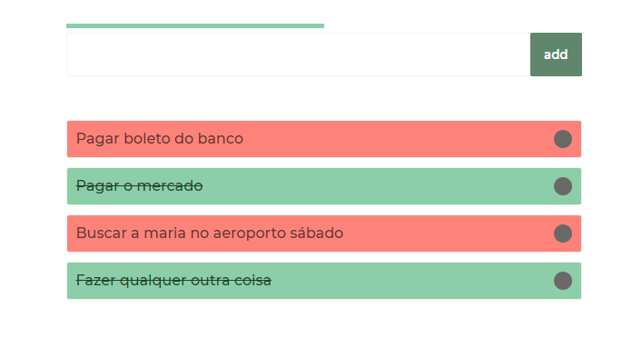
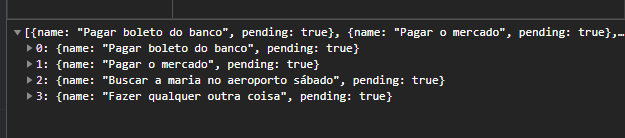
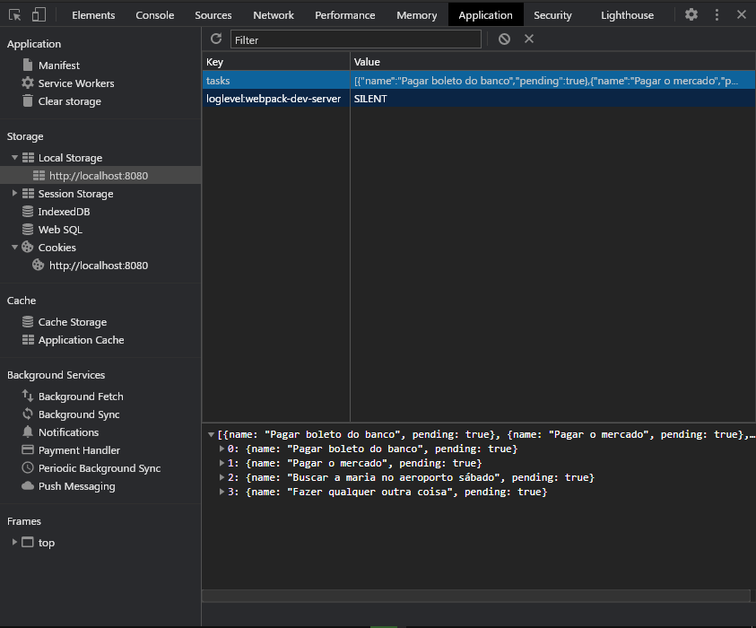

# ToDo List em VueJS usando LocalStorage

O clássico ToDo List, onde a gente aprende a montar e ver um CRUD acontecendo na tecnologia que estamos aprendendo.
Simples como sempre e comom tem q ser, mas que funciona para fixarmos os estudos e o que estamos aprendendo.
Nesse caso em __VueJS__, fez com que fosse trabalhado conceitos como: componentes, propiedades computadas, metodos de ciclo de vida, v-binds, eventos e modificadores de eventos, comunicação entre componentes sem usar um gerenciador de evento, laços, entre outras coisas consideradas "básicas" para se trabalhar com Vue.

##### As únicas dependências são as do vue

As tarefas possuem 2 estados: pendente (fica vermelha) ou não (fica verde)
Automaticamente no cadastro elas são tarefas pendentes

Fica concluída clicando em cima
Clicando de novo ela volta a ser considerada pendente

Felipe Oliveira

[Instagram](https://www.instagram.com/felipeoli7eira/)

[linkedIn](https://www.linkedin.com/in/felipeoli7eira/)
